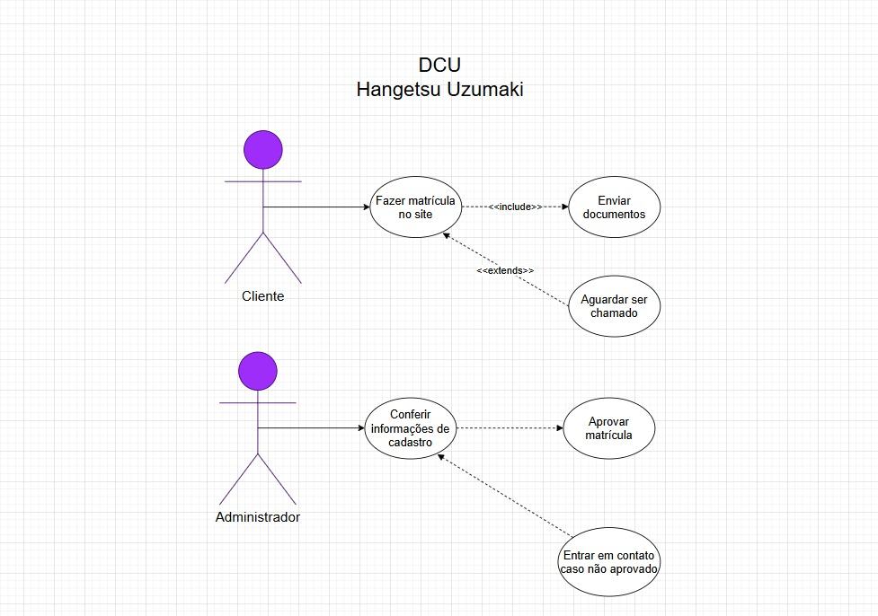
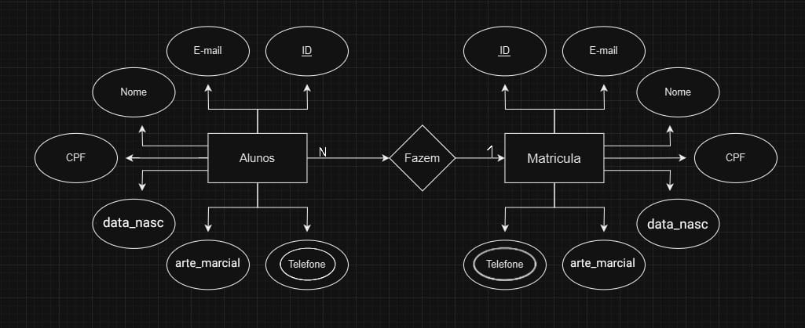
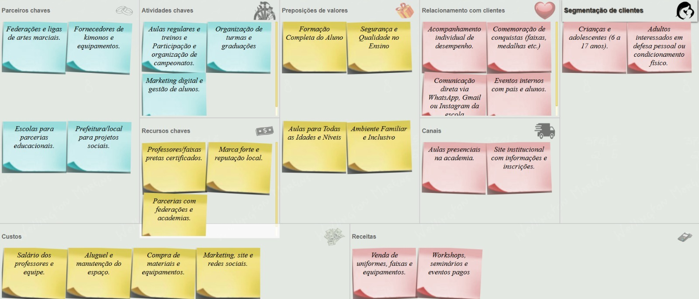

# Artes Marciais (Martial arts)

- Metodologia: Kanban (- Methodology: Kanban)
- Tema inicial: Hangetsu Uzumaki - Artes Marciais (- Initial theme: Hangetsu Uzumaki - Martial Arts)

|Recursos|Papéis e Responsabilidades|
|-|-|
|Hélio|Back/Teste/Banco de dados|
|João Santos|Front/Banco de Dados|
|Rhayssa|Front/Banco de Dados|

|Resources|Roles and Responsibilities|
|-|-|
|Hélio|Back/Test/Database|
|João Santos|Front/Database|
|Rhayssa|Front/Database|

## Repositórios do Projeto (Project Repositories)
- [Front-End (Web)](https://github.com/helio000/web-projeto2)
- [Back-End (API)](https://github.com/helio000/back-projeto-2025)
- [mobile-projeto (app)](https://github.com/helio000/mobile-artes-marciais)


## Diagramas do Projeto (Project Diagrams)

## 📘 Diagrama de Classes (Back‑End) (Class Diagram (Back-End))


## 📗 DCU do Projeto (Project DCU ())


## 📙 Diagrama do Projeto (Project Diagram)

 
## 💀 canva (canvas)
 

## 👽 triangulo de ferro (iron triangle)


## 🫡 swot (swot)


## Checklist de Testes – Projeto (Test Checklist – Project)

## Testes Gerais (General Tests)

Verificar se o endpoint / retorna 200 e informações da API. (Check if the / endpoint returns 200 and API information)

## Testes de Alunos (student tests)

[x]Criar aluno (POST /alunos) → verificar campos obrigatórios e email único.(Create student (POST /students) → check required fields and unique email.())

[x]Listar todos alunos (GET /alunos) → deve retornar lista completa.(List all students (GET /students) → should return a complete list)

[x]Obter aluno por ID (GET /alunos/:id) → 200 se existir, 404 se não existir.(Get student by ID (GET /students/:id) → 200 if exists, 404 if doesn't)

[]Atualizar aluno (PUT/PATCH /alunos/:id) → alterar campos opcionais, mantendo email único.(Update student (PUT/PATCH /students/:id) → change optional fields, keeping unique email)

[x]Remover aluno (DELETE /alunos/:id) → 200 ou 204.(Remove student (DELETE /students/:id) → 200 or 204)

[x]Login do aluno (POST /alunos/login) → com credenciais válidas retorna token; inválidas retorna 400.(Student login (POST /students/login) → with valid credentials, returns token; with invalid credentials, returns 400)

[x]Validar token do aluno (GET /alunos/login) → 200 com token válido; 401 com token inválido/expirado.(Validate student token (GET /students/login) → 200 with valid token; 401 with invalid/expired token)

## Testes de Professores(teacher tests)

[x]Criar professor (POST /professores) → verificar campos obrigatórios e email único.(Create class (POST /turmas) → check required fields. (Create class (POST /turmas) → check required fields.))

[x]Listar todos professores (GET /professores) → deve retornar lista completa.(List all classes (GET /turmas) → should return a complete list)

[x]Obter professor por ID (GET /professores/:id) → 200 se existir, 404 se não existir.(Get class by ID (GET /turmas/:id) → 200 if it exists, 404 if it doesn't)

[x]Atualizar professor (PUT/PATCH /professores/:id) → alterar campos opcionais, mantendo email único.(Update class (PUT/PATCH /turmas/:id) → change optional fields)

[x]Remover professor (DELETE /professores/:id) → 200 ou 204.(Remove class (DELETE /turmas/:id) → 200 or 204)


## Testes de Turmas(class tests)

[x]Criar turma (POST /turmas) → verificar campos obrigatórios.(Create class (POST /turmas) → check required fields)

[x]Listar todas turmas (GET /turmas) → deve retornar lista completa.()

[x]Obter turma por ID (GET /turmas/:id) → 200 se existir, 404 se não existir.()

[x]Atualizar turma (PUT/PATCH /turmas/:id) → alterar campos opcionais.()

[x]Remover turma (DELETE /turmas/:id) → 200 ou 204.()


[x]Listar todas turmas (GET /turmas) → deve retornar lista completa.(List all classes (GET /turmas) → should return a complete list)

[x]Obter turma por ID (GET /turmas/:id) → 200 se existir, 404 se não existir.(Get class by ID (GET /turmas/:id) → 200 if it exists, 404 if it doesn't)

[x]Atualizar turma (PUT/PATCH /turmas/:id) → alterar campos opcionais.(Update class (PUT/PATCH /turmas/:id) → change optional fields)

[x]Remover turma (DELETE /turmas/:id) → 200 ou 204.(Remove class (DELETE /turmas/:id) → 200 or 204)

## Testes de Matrículas (enrollment tests)

[x]Criar matrícula (POST /matriculas) → verificar campos obrigatórios, relacionamentos válidos com aluno e turma.(Create enrollment (POST /enrollments) → check required fields, valid relationships with student and class.)

[x]Listar todas matrículas (GET /matriculas) → deve retornar lista completa.(List all enrollments (GET /enrollments) → should return a complete list)

[x]Obter matrícula por ID (GET /matriculas/:id) → 200 se existir, 404 se não existir.(Get enrollment by ID (GET /enrollments/:id) → 200 if it exists, 404 if it doesn't)

[x]Atualizar matrícula (PUT/PATCH /matriculas/:id) → alterar campos opcionais.(Update enrollment (PUT/PATCH /enrollments/:id) → change optional fields.)

[x]Remover matrícula (DELETE /matriculas/:id) → 200 ou 204.(Remove enrollment (DELETE /enrollments/:id) → 200 or 204)


## Passo a passo para testar
- 1 Clone este repositório
- 2 Abra o repositório com o VsCode, Abra um terminal **CTRL + '** cmd ou bash
- 3 Abra o XAMPP e inicie o SGBD **MySQL**, ou inicie o MySQL da forma que preferir.
- 4 Crie dentro da pasta ./api um arquivo chamado **.env** contendo as seguintes variáveis de ambiente:
```js
DATABASE_URL="mysql://root@localhost:3306/escola?schema=public&timezone=UTC"
